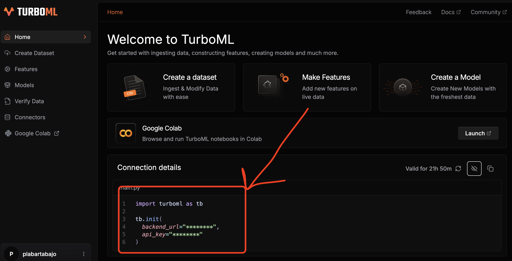
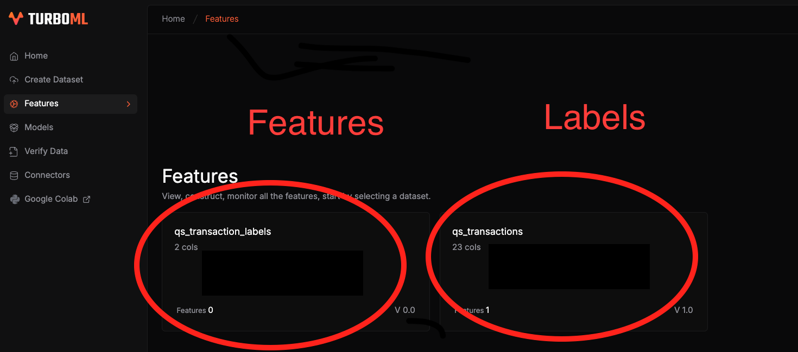

<div align="center">
    <h1>Let's build an end-2-end real time ML system</h1>
    <h3><i>"If I have seen further it is by standing on the shoulders of <s>Giants</s> <a href="https://turboml.com/">TurboML</a>"</i></h3>
<h4>― Isaac Newton</h4>

</div>

### Table of contents

- [What is this repo about?](#what-is-this-repo-about)
- [The problem](#the-problem)
- [The solution](#the-solution)
- [Steps](#steps)
    - [1. Install the tools](#1-install-the-tools)
    - [2. Set your TurboML credentials](#2-set-your-turboml-credentials)
    - [3. Create a feature pipeline](#3-create-a-feature-pipeline)
    - [4. Define and deploy a Machine Learning model](#4-define-and-deploy-a-machine-learning-model)
    - [5. Generate live predictions](#5-generate-live-predictions)
    - [6. Model monitoring](#6-model-monitoring)
    - [7. Model comparison](#7-model-comparison)
- [Now it is your turn](#now-it-is-your-turn)
- [Wanna learn more Real World ML/MLOps?](#wanna-learn-more-real-world-mlmlops)

## What is this repo about?

In this repository you will find an end-2-end example of a real time ML system to predict credit card fraud, built on top of the **[TurboML platform](https://turboml.com/)**.

Feel free to adjust it to your own use case

* crypto price prediction
* click-through rate prediction
* anomaly detection, or
* whatever problem that needs ML models to quickly adapt to changing patterns

Let's dive in!


## The problem

Every time your credit card is used online by someone (hopefully you), your card issuer has to check whether the transaction is legitimate.

Behind the scenes, your credit card issuer (e.g. Visa, Mastercard, etc.) runs a real time ML system, that

1. Ingests the transaction data

    

2. Enriches the data with additional features (aka feature engineering).

    

3. Pipes these feature into a Machine Learning model. In this case, a classification model that outputs a fraud score. If the score
is above a certain threshold, the transaction is flagged as a fraud.

    

4. Serves these scores and flags to downstream services, so they can act accordingly, for example:
    - Block the transaction
    - Ban the card
    - Send an SMS alert to the user
    
    

The system is modular, so different feature engineering logic and models can be applied for the same incoming data.
This way their internal Data Science teams can do things like:

- Experiment with different feature engineering logic
- Experiment with different model architectures
- Compare the performance of different models, for safe deployments.
- Monitor the model performance over time
- Retrain the model incrementally on new data, to quickly adapt to changing fraud patterns.

But the thing is, building the underlying MLOps platform that supports these workflows is no piece of cake.

So the question is:
> How do you build a production-ready ML system, without having to build from scratch such a platform?

And here is when TurboML comes to the rescue!


## The solution

We will build on top of [Turbo ML](https://turboml.com/), a real time ML platform that allows you to quickly
build production-ready real time ML systems.

The idea is simple (and brilliant).

We define the business logic in Python, including
- data sources
- feature engineering logic
- model training and evaluation metrics

and TurboML handles all the infrastructure and low-level details to bring this logic to life.

So you go from idea to production at light speed.


## Steps

### 1. Install the tools

These are the tools you will need to follow the hands-on example:

- [Docker](https://docs.docker.com/desktop/) to spin up Docker containers on your machine
- [VSCode](https://code.visualstudio.com/) to open the repository, or any other IDE that supports devcontainers.
- [Dev Containers extension](https://code.visualstudio.com/docs/remote/containers) to open the repository in a devcontainer


### 2. Set up the development environment

This repository comes with a pre-configured [devcontainer](./devcontainer/devcontainer.json) that you can use to get started.

This is a Linux container based on an official Docker image built by the TurboML team, that comes with the TurboML Python SDK pre-installed. So you can start coding right away.

> **Why use a devcontainer?**
>
> Devcontainers are a powerful way to create a reproducible development environment. They allow
> - easy cross-platform development, and
> - are a great way to onboard new developers.

To open the repository inside this dev devcontainer, you:

- ```git clone this repository```
- Reopen the repository in VSCode with the Dev Containers extension, either by
  - running the command palette (Ctrl+Shift+P) and selecting `Dev Containers: Reopen in Container`
  
  - or by clicking on the `Dev Container` tab in the bottom left of the VSCode window and selecting `Reopen in Container`
    

It will take a few minutes to download the Docker image and start the container. Once everything is ready, open a new terminal
window and double-check you are in a devcontainer by running

```bash
$ uname -a
```
and you should see something like this:

```bash
Linux 1821e9cf7662 6.10.14-linuxkit #1 SMP Fri Nov 29 17:22:03 UTC 2024 x86_64 x86_64 x86_64 GNU/Linux
```

The devcontainer is just another Docker container running on your machine, so you can interact with it as you would do with any other Docker container. In particular, if you open Docker Desktop, you should see the devcontainer running.

Here is mine:


### 2. Set your TurboML credentials

Copy the `.env.example` file into a new `.env` file

```bash
cp .env.example .env
```

and replace the placeholder with your own credentials.

```.env
TURBOML_BACKEND_URL="YOUR_BACKEND_URL_GOES_HERE"
TURBOML_API_KEY="YOUR_API_KEY_GOES_HERE"
```

To get these credentials, sign up for free at [TurboML](https://turboml.com/)
and you will get a workspace with a backend URL and an API key.



### 3. Create a feature pipeline

This is the first pipeline you need to build a real time ML system.

To do this in TurboML, you first need to create a dataset object for your

- **features** -> set of variables you use to generate predictions, and

- **labels** -> target variable you want to predict

This is what the `create_datasets` function does.

```python
# setup_feature_pipeline.py
transactions, labels = create_datasets(
    transactions_dataset_name=config.transactions_dataset_name,
    labels_dataset_name=config.labels_dataset_name,
    n_samples=100,
)
```

Once you have the dataset objects, you can define the feature engineering logic you want to apply on top of them:

```python
# setup_feature_pipeline.py
define_feature_engineering(transactions)
```

All this logic is encapsulated in the `setup_feature_pipeline.py` file, that you can run with the following command:

```bash
make feature-pipeline
```

After running this command, you should see 2 feature groups in your dashboard:




### 4. Define and deploy a Machine Learning model

Fraud patterns are not static, but evolve over time. Fraudsters are always coming up with new ways to defraud credit card companies, so your ML system needs to adapt
to these changes, to keep up with the latest fraud trends.

To accomplish this, you typically need to:

- Use historical data to train a good initial model. This is often called, offline training.

- Deploy this model either as a streaming job, or as a REST API, so it can start making predictions on new data.

- Add monitoring to the model, so you can detect if it's performing poorly.

- Update the model parameters incrementally as new pairs (input, label) come in. This technique is called online training, or incremental training. The updated model needs to be redeployed frequently, to keep up with the latest fraud trends.

With TurboML, you save yourself the hassle of building all this infrastructure from scratch.

Instead, you define the model training logic in Python, using the features and labels we created in the previous step, and TurboML will take care of

- Deploying the model either as a streaming job, or as a REST API
- Monitoring the model performance
- Updating the model parameters incrementally

All this is encapsulated in the `setup_model.py` file, that you can run with the following command:

```bash
make model
```

After running this command, you should see the model deployed in your dashboard:


### 5. Generate live predictions

Let's put our model to work. Let's start generating live data of transactions and labels, and see how the model performs.

I created a `generate_live_data.py` script to generate live data. This script samples historical data to simulate a live stream of transactions and labels, and pushes them to the online datasets we created in the previous steps.

```bash
make live-data
```

> **What about real-world data?**
> 
> In a real-world scenario, this data would come from your data sources, for example a Kafka topic or a database table.
> 
> These are called `Connectors` in the TurboML platform.
> 
> 

### 6. Model monitoring

After running the previous command, you can check the model performance on the dashboard:


### 7. Model comparison

Typically, you will want to compare the performance of different models, to see which one performs better.

You can easily do this by:

- Updating the model_name in the `config.py` file -> e.g. `model_name = "fraud_detection_model_2"`
- Running the `setup_model.py` script again
- Comparing the performance of the new model with the old one on the TurboML dashboard.


## Now it is your turn

Sign up for free at [TurboML](https://turboml.com/) and build your own end-2-end real time ML system.

- You can build on top of this example, for example, trying to improve the accuracy of the system with furter feature engineering and model tunning.

or

- You can build your own end-2-end real time ML system, by plugging in your own real time data source.

BOOM!

## Wanna learn more Real World ML/MLOps?
Subscribe for free to my newsletter to get notified when I publish new articles and courses:

👉👉🏻👉🏼👉🏽👉🏾👉🏿 [Subscribe](https://paulabartabajo.substack.com/)

👉👉🏻👉🏼👉🏽👉🏾👉🏿 [Courses](https://www.realworldml.net/courses)